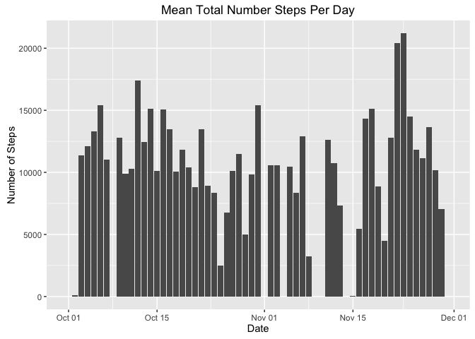
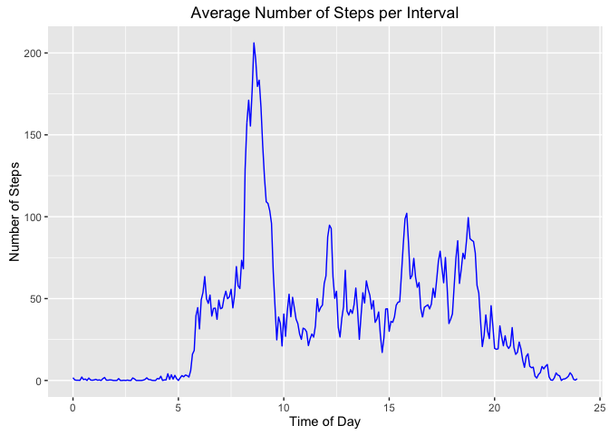
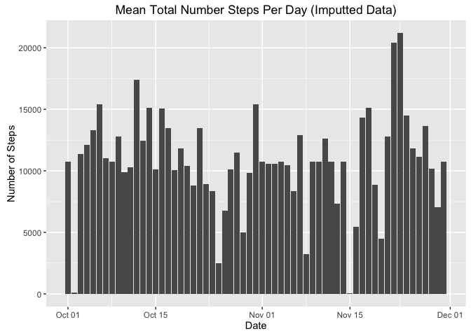
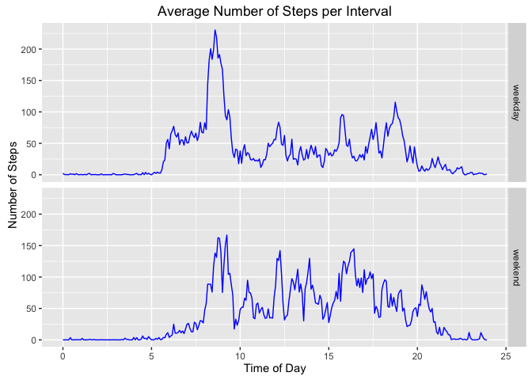

# Reproducible Research: Peer Assessment 1


## Loading and preprocessing the data


```r
library(dplyr)
```

```
## 
## Attaching package: 'dplyr'
```

```
## The following objects are masked from 'package:stats':
## 
##     filter, lag
```

```
## The following objects are masked from 'package:base':
## 
##     intersect, setdiff, setequal, union
```

```r
library(ggplot2)
library(lubridate)

data <- read.csv(unz("activity.zip", "activity.csv")) %>%
  mutate(date=as.Date(date, format="%Y-%m-%d")) %>%
  # interval is not continuous through the day, there are gaps, 55 - 100, etc
  # create a continuous interval
  mutate(real_interval = 
            floor(interval / 100) +
            (interval / 100 - floor(interval / 100)) / .6
  )

str(data)
```

```
## 'data.frame':	17568 obs. of  4 variables:
##  $ steps        : int  NA NA NA NA NA NA NA NA NA NA ...
##  $ date         : Date, format: "2012-10-01" "2012-10-01" ...
##  $ interval     : int  0 5 10 15 20 25 30 35 40 45 ...
##  $ real_interval: num  0 0.0833 0.1667 0.25 0.3333 ...
```

```r
head(data)
```

```
##   steps       date interval real_interval
## 1    NA 2012-10-01        0    0.00000000
## 2    NA 2012-10-01        5    0.08333333
## 3    NA 2012-10-01       10    0.16666667
## 4    NA 2012-10-01       15    0.25000000
## 5    NA 2012-10-01       20    0.33333333
## 6    NA 2012-10-01       25    0.41666667
```

## What is mean total number of steps taken per day?


```r
daily_average_data <- data %>%
  group_by(date) %>%
  summarise(steps=sum(steps, na.rm = TRUE))

ggplot(daily_average_data, aes(x = date, y = steps)) +
  geom_bar(stat = "identity") +
  xlab("Date") +
  ylab("Number of Steps") +
  ggtitle("Mean Total Number Steps Per Day")
```



### Mean average of total steps per day

```r
mean(daily_average_data$steps, na.rm = TRUE)
```

```
## [1] 9354.23
```
### Median of total steps per day

```r
median(daily_average_data$steps, na.rm = TRUE)
```

```
## [1] 10395
```

## What is the average daily activity pattern?


```r
interval_average_data <- data %>%
  group_by(interval, real_interval) %>%
  summarise(steps = mean(steps, na.rm = TRUE))
  
ggplot(data = interval_average_data, aes(x = real_interval, y = steps)) + 
  geom_line(color = "blue") +
  xlab("Time of Day") +
  ylab("Number of Steps") +
  ggtitle("Average Number of Steps per Interval")
```



### Which 5-minute interval contains the maximum number of steps?

```r
max_index <- which.max(interval_average_data$steps)
max_interval <- interval_average_data$interval[max_index]

max_interval
```

```
## [1] 835
```

```r
sprintf("Time with maximum number of steps is: %d:%d", floor(max_interval / 100), round((max_interval / 100 - floor(max_interval / 100)) * 100))
```

```
## [1] "Time with maximum number of steps is: 8:35"
```

## Imputing missing values

```r
sprintf("Total number of NA values is: %d", sum(is.na(data$steps)))
```

```
## [1] "Total number of NA values is: 2304"
```

```r
imputted_data <- inner_join(data, interval_average_data, by="interval") %>%
  mutate(steps = ifelse(is.na(steps.x), steps.y, steps.x)) %>%
  rename(real_interval = real_interval.x) %>%
  select(steps, date, interval, real_interval)

daily_averages_imput <- imputted_data %>%
  group_by(date) %>%
  summarise(steps = sum(steps, na.rm = TRUE))

ggplot(daily_averages_imput, aes(x = date, y = steps)) +
  geom_bar(stat = "identity") +
  xlab("Date") +
  ylab("Number of Steps") +
  ggtitle("Mean Total Number Steps Per Day (Imputted Data)")
```



### Mean average of total steps per day

```r
mean(daily_averages_imput$steps, na.rm = TRUE)
```

```
## [1] 10766.19
```
### Median of total steps per day

```r
median(daily_averages_imput$steps, na.rm = TRUE)
```

```
## [1] 10766.19
```

The mean and median values are now higher since we replace NA values with new positive values.

## Are there differences in activity patterns between weekdays and weekends?

```r
fac <- factor(c("weekday", "weekend"))
  
dayweek_averages <- imputted_data %>%
  mutate("DayWeek" = fac[wday(date) %in% c(1, 7) + 1]) %>%
  group_by(interval, real_interval, DayWeek) %>%
  summarise(steps = mean(steps, na.rm = TRUE))

ggplot(dayweek_averages, aes(x = real_interval, y = steps)) + 
  geom_line(color = "blue") +
  xlab("Time of Day") +
  ylab("Number of Steps") +
  ggtitle("Average Number of Steps per Interval") +
  facet_grid(DayWeek ~ .)
```


